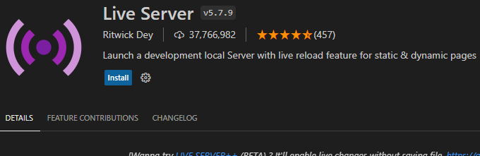
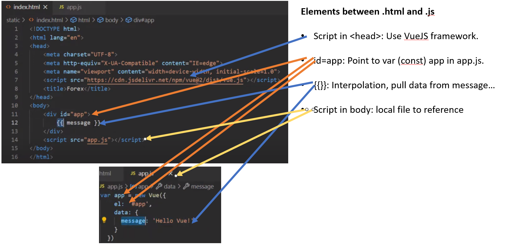

# Front End Set Up

Install "Live Server" extension.

# [VueJS - Javascript Utilities - Homepage](https://vuejs.org/)

Attempt!!:  Put Javascript/HTML in a nutshell view:

# Function Overview:
### To run data refreshes:  python run_tasks.py

* This currently runs on a (hard coded) 1 minute schedule
* Invokes save_file function in data_prep.py
* Which in turn invokes prepare_data function
  * Note:  A time-stamp has been added to the file output.
* Which in turn calls the Oanda_API to get data, and
* Write the data to data.json

### To run Browser (from the directory that the app.js is in):  flask run
